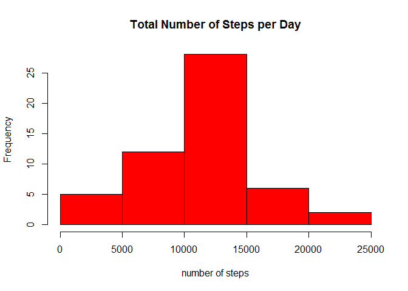
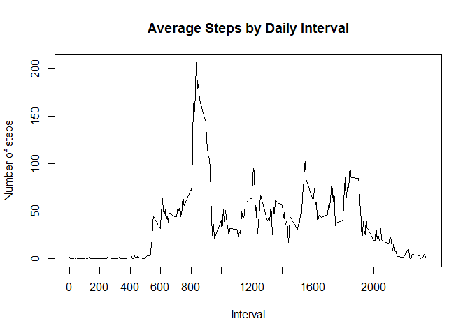
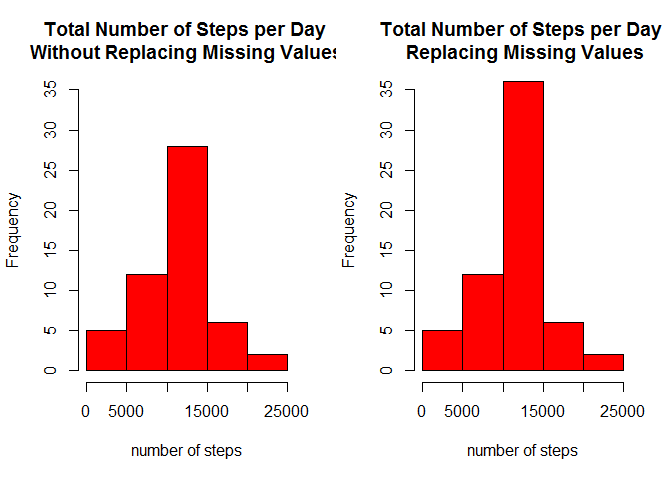
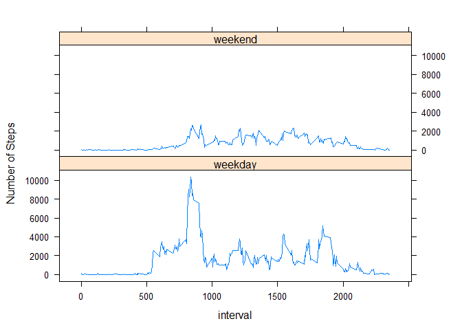

# Reproducible Research: Peer Assessment 1


## Loading and preprocessing the data
First lets start by loading the required data and libraries and preprocessing the data so that the information under the date column is recognized as a date.

```r
library(lattice)
activity<-read.csv("activity.csv")
activity$date<-as.Date(activity$date,format="%Y-%m-%d")
```


## What is mean total number of steps taken per day?
In order to find the mean total number of steps taken per day we must first find the total number of steps taken each day, then find the mean.

```r
stepsDay<-aggregate(steps~date,data=activity,sum)
```
Next we generate a histogram of the number of steps taken per day  

```r
hist(stepsDay$steps,main="Total Number of Steps per Day", col="red",xlab="number of steps")
```

 

Finally we find the mean and median for the total number of daily steps (NA values will not be computed):

```r
a<-c(mean(stepsDay$steps,na.rm=TRUE),median(stepsDay$steps,na.rm=TRUE))
names(a)<-c("Mean","Median")
a
```

```
##     Mean   Median 
## 10766.19 10765.00
```

## What is the average daily activity pattern?
The following describes the average daily activity pattern  distinguished by 5 minute time intervals for the information provided  

```r
avgSteps<-aggregate(steps~interval,data=activity,mean)
plot(avgSteps$interval,avgSteps$steps,type="l",main="Average Steps by Daily Interval",xlab="Interval",ylab="Number of steps",xaxt="n")
axis(1,at=seq(0,max(avgSteps$interval),200),las=1)
```

 

Looking at the plot, it is clear that the 5 minute interval which, on average, has the largest ammount of steps is around the 800 minute interval. In order to find the exact interval:  

```r
avgSteps$interval[which(avgSteps$steps==max(avgSteps$steps))]
```

```
## [1] 835
```

## Imputing missing values
1. The total number of NAs in the data is the following:  

```r
sum(is.na(activity$steps))
```

```
## [1] 2304
```

2. In order to fill missing data, the average of the 5 minute interval for all days is used:

```r
Nas<-which(is.na(activity$steps))
Replace<-avgSteps$steps[which(avgSteps$interval %in% activity$interval[Nas])]
newActivity<-activity
newActivity$steps[Nas]<-Replace
```

3. This gives a new data set with all missing values replaced with the average of the time interval across all days.  

4. With this new dataset we find the total sum per day:  

```r
newStepday<-aggregate(steps~date,data=newActivity,sum)
hist(newStepday$steps,main="Total Number of Steps per Day", col="red",xlab="number of steps")
```

 

And finde the mean and median for the total number of steps taken per day.


```r
b<-c(mean(newStepday$steps),median(newStepday$steps))
names(b)<-c("Mean","Median")
b
```

```
##     Mean   Median 
## 10766.19 10766.19
```

By comparing the results with those found earlier without using the missing values replacement strategy:


```r
par(mfrow=c(1,2))
hist(stepsDay$steps,main="Total Number of Steps per Day \nWithout Replacing Missing Values", col="red",xlab="number of steps",ylim=c(0,35))
hist(newStepday$steps,main="Total Number of Steps per Day \n Replacing Missing Values", col="red",xlab="number of steps",ylim=c(0,35))
```

 

```r
c<-data.frame(rbind(a,b))
row.names(c)<-c("NA Values","NA Values Replaced")
c
```

```
##                        Mean   Median
## NA Values          10766.19 10765.00
## NA Values Replaced 10766.19 10766.19
```

As can be seen, there is a slight variation in extreme values, the mean however, remains the same, this due to using value means to replace missing values.

## Are there differences in activity patterns between weekdays and weekends?

1. First lets add a new factor variable identifying each day as either a weekday or weekend:  

```r
# Set system to use english language for uniformity
Sys.setlocale("LC_TIME", "C")
```

```
## [1] "C"
```

```r
weekday<-which(!weekdays(newActivity$date)=="Sunday"&!weekdays(newActivity$date)=="Saturday")
weekend<-which(weekdays(newActivity$date)=="Sunday"|weekdays(newActivity$date)=="Saturday")
parse<-seq(1,as.numeric(dim(newActivity)[1]))
parse[weekday]<-"weekday"
parse[weekend]<-"weekend"
newActivity<-cbind(newActivity,parse)
names(newActivity)[4]<-"Weekday"
```

With this new information we aggregate in order to obtain the average number of steps taken by interval, across all weekdays and across all weekend days:

```r
newActiInter<-aggregate(newActivity$steps,by=list(interval=newActivity$interval,weekday=newActivity$Weekday),mean)
names(newActiInter)[3]<-"steps"
```

2. Next we make a panel plot differentiating between weekday and weekend data:

```r
xyplot(steps~interval|weekday,newActiInter,type="l",layout=c(1,2),ylab="Number of Steps")
```

 


